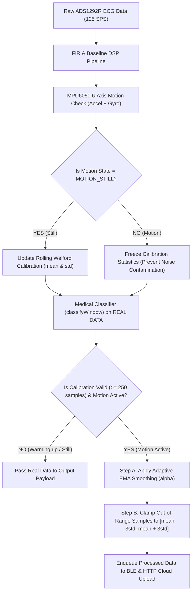

# SWET_IOT — ECG Data Calibration & Motion Noise Reduction Guide

This document explains how the **SWET_IOT Wearable ECG Device** calibrates ECG data in real-time and reduces motion artifacts during daily activity.

---

## 1. Overview

During daily activity, body movement introduces large voltage spikes (motion artifacts) into the ECG signal. The SWET_IOT system uses a **Calibration-Range-Based Motion Noise Reduction** pipeline:
1. **Continuous Resting Calibration:** When the user is sitting or resting still, the system continuously learns the user's normal heartbeat amplitude and baseline.
2. **Adaptive Motion Noise Reduction:** When motion occurs, the system applies whole-waveform **Adaptive EMA Smoothing** to reduce jitter, followed by **Hard Range Clamping** to bound extreme spikes.

---

## 2. Key Terms Explained

| Term | Definition | Formula / Range | Simple Explanation |
| --- | --- | --- | --- |
| **`seq`** | Block Sequence Number | `1, 2, 3, ...` | Counter for each 1-second (125-sample) streaming ECG block. |
| **`MOTION_STILL`** | Combined Stillness State | Accel Var $< 0.015$, Gyro $< 10.0^\circ/\text{s}$ | True physical rest (both accelerometer and gyroscope are quiet). |
| **`MOTION_LIGHT`** | Light Movement State | Accel Var $< 0.120$, Gyro $< 35.0^\circ/\text{s}$ | Mild body movement (small shifts, gestures). |
| **`MOTION_HIGH`** | High Motion State | Accel Var $\ge 0.120$ or Gyro $\ge 35.0^\circ/\text{s}$ | Heavy movement (walking, running, shaking). |
| **`mean` ($\mu$)** | Baseline Voltage Level | $\approx 2048$ ADC counts | The middle baseline voltage of your ECG signal. |
| **`std` ($\sigma$)** | Standard Deviation | e.g. `40.0` to `80.0` ADC counts | The natural height/amplitude spread of your resting heartbeat (QRS peak, T-wave). |
| **Welford's Algorithm** | Online Statistics Algorithm | $\mu_k = \mu_{k-1} + \frac{x_k - \mu_{k-1}}{k}$ | A numerically precise algorithm that updates mean and variance without floating-point drift over long runs. |
| **`CALIBRATION_MIN_SAMPLES`** | Warm-up Gate | `250` samples (2 seconds) | Minimum stillness required after power-on before calibration becomes active. |
| **`range`** | Normal Amplitude Bounds | $[\mu - 3.0\sigma, \; \mu + 3.0\sigma]$ | Your personal normal voltage window. $3.0\sigma$ covers **99.7%** of natural heartbeat variation. |
| **`noise ratio` ($R$)** | Motion Noise Intensity Ratio | $R = \frac{\sigma_{\text{motion}}}{\max(\sigma_{\text{calibrated}}, 10.0)}$ | Compares motion noise intensity against your resting baseline noise. |
| **`alpha` ($\alpha$)** | Adaptive EMA Smoothing Strength | $0.10 \le \alpha \le 0.85$ | EMA filter coefficient. Lower $\alpha$ ($0.10$) = heavy smoothing for intense noise; higher $\alpha$ ($0.85$) = light smoothing. |
| **`clamped`** | Clamped Sample Count | `0` to `125` samples | The number of samples in a block exceeding `range` that were clamped to normal bounds. |

---

## 3. How Calibration Works (Step-by-Step)



### Step 1: 6-Axis Motion Classification
The MPU6050 measures accelerometer variance and gyroscope magnitude ($\text{gyroMag}$ in $^\circ/\text{s}$). Motion is classified as `MOTION_STILL` ONLY if BOTH accelerometer and gyroscope are quiet.

### Step 2: Resting Calibration (Welford Algorithm)
During `MOTION_STILL`, clean ECG samples are fed into a 625-sample (5-second) rolling circular buffer. Welford's algorithm continuously updates the mean ($\mu$) and standard deviation ($\sigma$). During motion (`MOTION_LIGHT` / `MOTION_HIGH`), calibration updates are **frozen** so motion noise does not corrupt the resting baseline.

### Step 3: Medical Alert Safeguard (Diagnostic Protection)
Before any motion smoothing or clamping takes place, `classifyWindow()` evaluates the **real, unmodified ECG signal**. If a medical event (such as Tachycardia, Bradycardia, or Sinus Arrest) occurs, hardware alerts (Buzzer/LED) and database warning flags (`"WARNING"`, `"CRITICAL"`) trigger immediately on real data.

### Step 4: Motion Noise Reduction (EMA + Hard Clamp)
During motion segments:
1. **Adaptive EMA Smoothing (Step A):** The noise ratio $R = \sigma_{\text{motion}} / \sigma_{\text{calibrated}}$ is computed. The smoothing factor $\alpha$ scales dynamically ($0.10 \le \alpha \le 0.85$) to reduce general jitter.
2. **Hard Range Clamping (Step B):** Any remaining sample outside $[\mu - 3.0\sigma, \; \mu + 3.0\sigma]$ is clamped to the calibrated boundary, keeping the live graph clean and readable.

---

## 4. Log Format Quick Reference

### `#RAW_ECG` Log (Raw Filtered Signal):
```text
#RAW_ECG   seq=53: min=1850 max=2240 mean=2048 (motionCount=15)
```
- **`seq`**: Block sequence number 53.
- **`min/max/mean`**: Raw ECG sample statistics for this block before noise reduction.
- **`motionCount`**: Number of samples in this block flagged as motion-affected.

### `#CALIB_ECG` Log (Calibrated & Processed Signal):
```text
#CALIB_ECG seq=53: min=1865 max=2230 mean=2048 (range=[1855,2241] std=64.3 3 clamped, alpha=0.62)
```
- **`range=[1855, 2241]`**: Calibrated normal voltage bounds $[\mu - 3\sigma, \; \mu + 3\sigma]$.
- **`std=64.3`**: Current resting standard deviation.
- **`3 clamped`**: 3 outlier motion samples exceeded range and were clamped.
- **`alpha=0.62`**: Adaptive EMA smoothing strength applied to this block.
